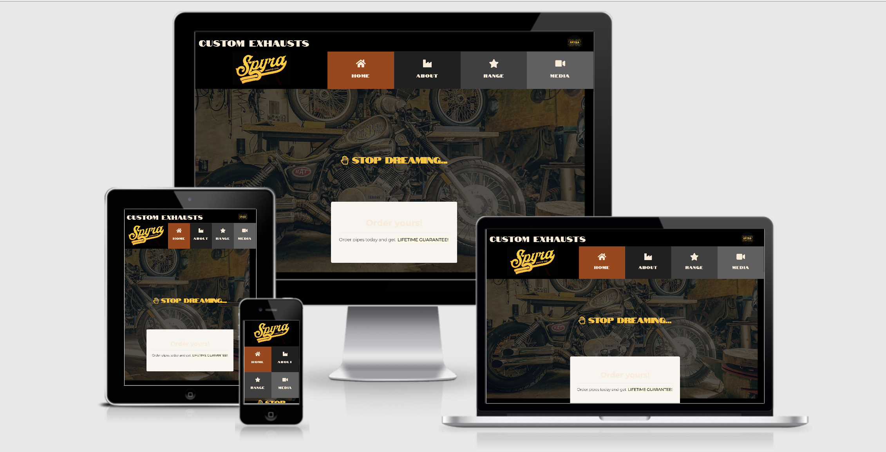

# SPYRAMOTO | CUSTOM EXHAUSTS
 

 
 
 
This project has been created as a proposition of the official website for a small but really existing company from metallurgy sector,  
that ran only social media accounts until now but grew up to stage where own www is a must-have for proper interactions with customers.
 
 

---

## Contents:

* UX
    * Project Goals
    * User Goals
    * User Stories
    * Designer Goals
    * Design Choices
        * Fonts
        * Colours       
* Wireframes
* Features
* Future Goals
* Technology Used
* Testing
    * Issues and Resolutions
* Known Bugs
* Deployment
* Credits
* Acknowledgements

 <!-- HERE GOES MANDATORY CI TEMPLATE:  -->

 

## UX (User Experience)

### Project Goals

The goal of this project is to create a static webpage with use of HTML and CSS languages that would be and official webpage of company

`FRESH NOTES:`

* The goal is to motivate an audience to take next step (call, text, e-mail or submit a web inquiry). Pages and features implemented are serving to that goal by many ways.

* More customers - who are these customers? How many more of them is needed? What exactly is expected of customers (BUY in first place, FOLLOW social media helping spread of the brand among friends)

* Who is the focus of the goal - a biker who wants to tunning their machine in significant way by adding hand crafted loud exhaust 

* Why they are motivated to buy? - to feel satisfaction while driving, to be noticed by other road users, to make impression in visited places by look and sound, to be reckognizable as differnet among all riders on the same model, to share their proud with social media.

* What they're worried about - high proces, extra fees, long time of product delivered, fake company, unskilled welder, `poor materials`, bad look of product. ESTABLISHING TRUST IS A KEY ISSUE TO INCREASE SALES.

* How to help them - making straight prices, no fees assurance, gain trust by proving buyers good experience and social media accounts ran over years, pictures of products and from buyerrs feedback.

* Goal is measureable via number of requests send to owner via social media and available contact details such as phone, whatsup or e-mail

* Perfect customer: visits webbsite, sends enquire to oreder pipes it's once-off, pretty rare that same customer will buy another pipes over the time. Next he could share his pretty pipes around all friends getting them jealous but interested.

* Whats working? What's not working? What could be better?

Goal: Increase sales.
Objectives: having a website to being officialy present in the internet, well-organized content, user-friendly site, effective calls to action, over the time establish good conversion rate (unsettled / unknown yet for this kind fo business and not having this sort of data from past).

Goal: Becoming an growing engineer.
Objectives: Providing information about research and tests to introduce new materials in future, establishing trust, marketing your site on other websites and social media.

Goal: Increase number of followers.
Objectives: establish easy access to owners socials channels.

Goal: Build your brand.
Objectives: Active social media program, promotions, reputation management.

### User goals

The main expected user is a broad field but expected to fall into one of the below criteria

1. A casual user
2. Someone wanting a quiz time waster with little to invest
3. Quiz enthusiast

With regards to other sites online, this site ideally needs to be

1. Easy to use
2. Be quick and easy to start and complete
3. Be able to restart and keep the user engaged consistently
4. Be updated with new content regularly 
5. Visually appealing but not too harsh on the eye

### User stories

Use this section to provide insight into your UX process, focusing on who this website is for, what it is that they want to achieve and how your project is the best way to help them achieve these things.

In particular, as part of this section we recommend that you provide a list of User Stories, with the following general structure:
- As a user type, I want to perform an action, so that I can achieve a goal.

This section is also where you would share links to any wireframes, mockups, diagrams etc. that you created as part of the design process. These files should themselves either be included as a pdf file in the project itself (in an separate directory), or just hosted elsewhere online and can be in any format that is viewable inside the browser.

## Features

In this section, you should go over the different parts of your project, and describe each in a sentence or so.
 
### Existing Features
- Feature 1 - allows users X to achieve Y, by having them fill out Z
- ...

For some/all of your features, you may choose to reference the specific project files that implement them, although this is entirely optional.

In addition, you may also use this section to discuss plans for additional features to be implemented in the future:

### Features Left to Implement
- Another feature idea

## Technologies Used

In this section, you should mention all of the languages, frameworks, libraries, and any other tools that you have used to construct this project. For each, provide its name, a link to its official site and a short sentence of why it was used.

- [JQuery](https://jquery.com)
    - The project uses **JQuery** to simplify DOM manipulation.

## Testing

In this section, you need to convince the assessor that you have conducted enough testing to legitimately believe that the site works well. Essentially, in this part you will want to go over all of your user stories from the UX section and ensure that they all work as intended, with the project providing an easy and straightforward way for the users to achieve their goals.

Whenever it is feasible, prefer to automate your tests, and if you've done so, provide a brief explanation of your approach, link to the test file(s) and explain how to run them.

For any scenarios that have not been automated, test the user stories manually and provide as much detail as is relevant. A particularly useful form for describing your testing process is via scenarios, such as:

1. Contact form:
    1. Go to the "Contact Us" page
    2. Try to submit the empty form and verify that an error message about the required fields appears
    3. Try to submit the form with an invalid email address and verify that a relevant error message appears
    4. Try to submit the form with all inputs valid and verify that a success message appears.

In addition, you should mention in this section how your project looks and works on different browsers and screen sizes.

You should also mention in this section any interesting bugs or problems you discovered during your testing, even if you haven't addressed them yet.

If this section grows too long, you may want to split it off into a separate file and link to it from here.

## Deployment

This section should describe the process you went through to deploy the project to a hosting platform (e.g. GitHub Pages or Heroku).

In particular, you should provide all details of the differences between the deployed version and the development version, if any, including:
- Different values for environment variables (Heroku Config Vars)?
- Different configuration files?
- Separate git branch?

In addition, if it is not obvious, you should also describe how to run your code locally.

## Credits

### Content
- The text for section Y was copied from the [Wikipedia article Z](https://en.wikipedia.org/wiki/Z)

### Media
- The photos used in this site were obtained from ...

### Acknowledgements

- I received inspiration for this project from X

 <!-- ALL ABOVE TO BE EDITED!  -->

 
 

--------

## VALUES

 
 

### FOR CLIENT / OWNER

The client has opportunity to display products in the Web, advertise extras, attract by highlighting offers to making order,  
prove experience as successful entrepreneur for number of years and show his technical skills through pictures of products  
and positive feedback from actual customers and fanpage visitors.
  
Heritage and trust gained by couple of years posting on healthy accounts Facebook and Instagram with no-fake-followers  
has been incorporated now into webpage to build strong image of “entrepreneur you can rely”. Pictures bringing closer to  
product and enthusiastic comments can assure visitors about how stable this company is.
  
There’s more behind this project – client motivated by creating process of website ordered new line of `logo` from States,  
that led to creating cool picture in terms of marketing and public relations. 
  
 
### FOR USER / VISITOR

The user has access to the gallery, gets offers, sees range of products and has possibility to ask for price or any additional  
questions through form or using contact details. Here highlighted WhatsApp feature informs that unwelcomed international  
call/text costs can be avoided, handy especially to ease contact for overseas buyers (company has a global range of consumers).
  
Visitor can recognise credibility of company, an essential verification based on insight into company social media profiles.  
That allows to assess owner’s timeline, check quality of followers, number of comments and likes. In times of scam websites  
and fake sellers it is appreciated “tool” for customer. Meanwhile it works perfectly for the owner to attract visitor to become  
a follower or further - earn a buyer.
  
Contact form delivers simple communication channel to ask whatever they like.
  
 
### HUMBLE ME

This project delivers values for both client and users. And for me, so it’s win-win-win

This was great opportunity to create content, set and consult PR line, invent and test some marketing tools and combine all  
that with good design. 

  
--------

Thanks for reading!

Bart

       

Credits for readme.md:

Code Institute  
Richard Wells 
https://stackoverflow.com/questions/4823468/comments-in-markdown

## Keep just for sampling in `.md` file

**Try this:** Ekhm _Prettier_ code *Open Browser* beautifier `app.py` extension now _do not_ auto-delete.

**Simply Samlpe:** This is the longest line bla bla bla bla bla bla bla bla will remain in your project. You can safely ignore them. They just make sure that your workspace is configured correctly each time you open it. It will also prevent the Gitpod configuration popup from appearing.

Check out the <a href="https://github.com/Eventyret/vscode-bcdn" target="_blank">README.md file at the official repo</a> for more options.

https://codeinstitute.s3.amazonaws.com/fullstack/ci_logo_small.png

Thanks for reading!

Bart