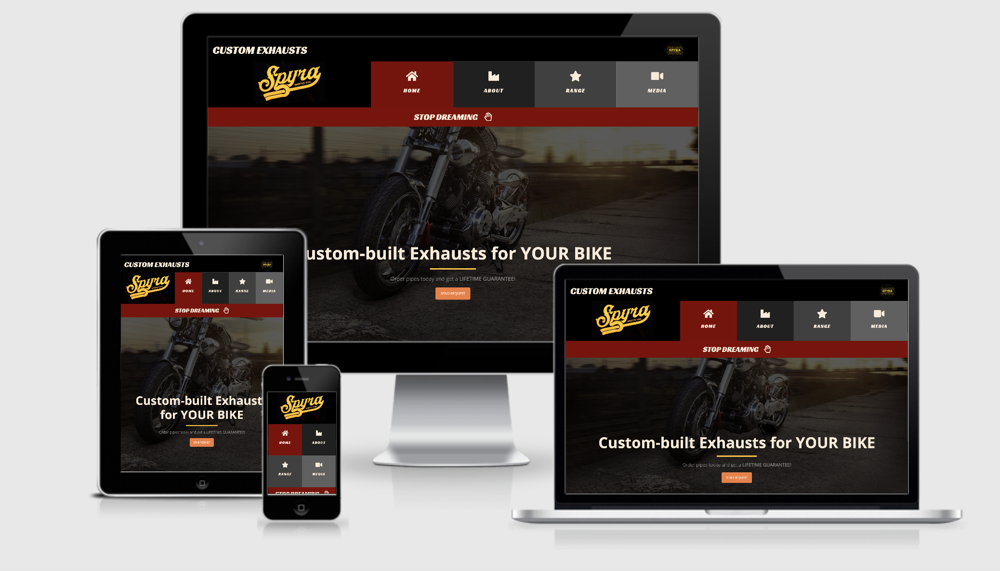
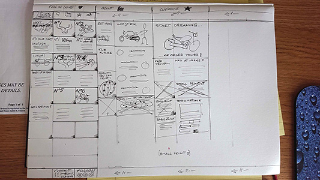

# SPYRAMOTO | CUSTOM EXHAUSTS
 

 
 
 
This project has been created as an official website for a small but really existing company from the market of custom-built motorcycle parts.  
It will be a debut website as they ran only social media accounts until now but grew up to stage where own www is a must-have for their goals.
 
 

---
## TO DO

* APPLY
    * fix Product footer position using Bootstrap cards
    * Based of project feedback 
        * introduce Back to top button
        * decrease Copyright disclaimer text size
        * replace pictures that makes bad impression (exhaust parts wrapped in black foil that looked like coroner's place)

* CHECK
    * Caps lock style on all subtitles all pages
    * Active Navigation button same as Titles background
    * If all links works correctly after deployment.

## Contents:

* TO DO
    * Apply
    * Check
* UX (User Experience)
    * Project Goals
    * Business Goals
    * Targeting
    * Business Values
    * User Goals
    * User Stories
    * Designer Goals
    * Design Choices
        * Fonts
        * Colours       
* Wireframes
* Features
* Future Goals
* Technology Used
* Testing
    * Issues and Resolutions
* Known Bugs
* Deployment
* Credits
* Acknowledgements

 <!-- HERE GOES MANDATORY CI TEMPLATE:  -->
 
 
 
 

## UX (User Experience)

### Project Goals

The goal of this project is to create with use of `HTML` and `CSS` languages a static front-end site that will link two parties by presenting 
information demanded by customers and desired by owner.

 
### Business Goals

* Goal: Increase sales.
    * Having a website to being officialy present in the internet, well-organized content, user-friendly site, effective calls to action, over the 
      time establish good conversion rate (unsettled / unknown yet for this kind of niche market and not having this sort of data from past),
    * Motivate an audience to take next step (call, text, e-mail or submit a web inquiry). Designed pages and implemented features should serving 
      to that goal by many marketing and decision-making ways.

* Gain trust.
    * Delivering history of company confirmed in timeline on social media,
    * Assuring quality of product by providing buyers reviews,
    * Upfront display of models highlighting quality of craftsmanship,
    * Offering lifetime warranty with shipment cost covered.

* Improve communication with potential customers. 
    * Present contact details for different communication channels.
        * Highlight benefits of WhatsApp costless contact.
   
* Increase number of social media real followers.
    * stablishing easy access to owners socials channels.

* Become an growing engineer.
    * Providing information about wide range of products, 
    * Releasing teaser about research and tests of new materials to be introduced in near future, 
    * Providing open-minded approach to external, unlisted models or requested extra shaped / custom-tailored projects.

 

### Targeting

* Who is the focus of the goal? 
    * a biker who wants to tuning their machine in significant way by adding hand crafted exhaust,
    * a friend or close person (or group) who knows one interest and want to buy a gift / surprise,
    * motorcycle owner, enthusiast of bold design.

* Why users buy a product? 
    * to feel satisfaction while driving,
    * to be noticed by other road users,
    * to make impression in visited places by look and sound,
    * to be recognizable differnet among all riders on the same bike model, 
    * to share their proud with social media,
    * to make a gift for someone else,
    * to reach for a Bucket List item.

* What they're worried about? 
    * high prices, 
    * hidden fees, 
    * long time of product delivered, 
    * fake company (scam), 
    * unskilled welder (bungler),
    * poor materials / quality, 
    * bad look of product (aesthetics). 
    

* How to help them? 
    * clear straight prices, 
    * walk through order to delivery process
    * assurance of delivery fee included (where possible - currently Europe), 
    * gain trust by proving buyers good experience and social media reputation, pictures of products and from buyerrs feedback.

### Business values

The owner has an opportunity to display products in the Web, advertise extras, attract buy decision by highlighting offers,  
prove experience as successful entrepreneur for number of years and show his technical skills through pictures of products  
and positive feedback from actual customers and fanpage visitors.
  
Heritage and trust gained by couple of years posting on healthy accounts Facebook and Instagram with no-fake-followers  
has been incorporated now into webpage to build strong image of “entrepreneur you can rely”. Pictures bringing closer to  
product and enthusiastic comments can assure new visitors about how stable this company is.
  
There’s more behind this project – client motivated by creating process of the website ordered new line of `logo` from States,  
that led to creating cool picture in terms of overall marketing and public relations. 
  
 

<!-- TO BE CONTINUED -->

### User goals

The main expected user falls into one of the below criteria:

* Motorcycle owner
* Motorcycle / classic / vehicle enthusiast
* Biker family or friends

*  Someone who seen one of the page photo content in image searching machine by looking for custom-built botorbike

### User stories

Research done at beggining of creatng this website delivered following goals:
* Need to veryfy if company is real
* Products quality/look meets potential buyer's expectations
* Find a proce without hassle of asking for 
* Get a contact details to ask specific questions

 
  

## Features

In this section, you should go over the different parts of your project, and describe each in a sentence or so.
 
### Existing Features
- Feature 1 - allows users X to achieve Y, by having them fill out Z
- ...

For some/all of your features, you may choose to reference the specific project files that implement them, although this is entirely optional.

In addition, you may also use this section to discuss plans for additional features to be implemented in the future:

### Features Left to Implement
- Buy now
- Filter: display all products for same bike model
- Embedded Google Maps with Buyers town location (respect to GDPR)

## Technologies Used

In this section, you should mention all of the languages, frameworks, libraries, and any other tools that you have used to construct this project. For each, provide its name, a link to its official site and a short sentence of why it was used.

- [JQuery](https://jquery.com)
    - The project uses **JQuery** to simplify DOM manipulation.

<!-- Popper.js and jQuerry - both as part of Boootstrap -->

Photoshop?
Bootstrap
Font Awesome

## Testing

In this section, you need to convince the assessor that you have conducted enough testing to legitimately believe that the site works well. Essentially, in this part you will want to go over all of your user stories from the UX section and ensure that they all work as intended, with the project providing an easy and straightforward way for the users to achieve their goals.

Whenever it is feasible, prefer to automate your tests, and if you've done so, provide a brief explanation of your approach, link to the test file(s) and explain how to run them.

For any scenarios that have not been automated, test the user stories manually and provide as much detail as is relevant. A particularly useful form for describing your testing process is via scenarios, such as:

<!-- Tested: links (correct destination, blank or not etc), hovers, responsiveness -->

1. Contact form:
    1. Go to the "Contact Us" page
    2. Try to submit the empty form and verify that an error message about the required fields appears
    3. Try to submit the form with an invalid email address and verify that a relevant error message appears
    4. Try to submit the form with all inputs valid and verify that a success message appears.

In addition, you should mention in this section how your project looks and works on different browsers and screen sizes.

You should also mention in this section any interesting bugs or problems you discovered during your testing, even if you haven't addressed them yet.

If this section grows too long, you may want to split it off into a separate file and link to it from here.

## Deployment

This section should describe the process you went through to deploy the project to a hosting platform (e.g. GitHub Pages or Heroku).

In particular, you should provide all details of the differences between the deployed version and the development version, if any, including:
- Different values for environment variables (Heroku Config Vars)?
- Different configuration files?
- Separate git branch?

In addition, if it is not obvious, you should also describe how to run your code locally.

## Credits

### Content
- All original content written by developer, except:
    - quoted reviews
    - quoted press articles
    
- The text for section Y was copied from the [Wikipedia article Z](https://en.wikipedia.org/wiki/Z)
- Press Intervews quotation approved by sources:
    - Blog
    - Made In Swietokrzyskie
    - Garage shed costam

### Media
- The photos used in this site were obtained from ...
    - Delivered by the owner
    - From developer own library
    - Thanks to courtesy of photographers/filmmakers: Wiktor Taszlow, Grzegorz Betkowski, Mateusz Iskra

### Acknowledgements

- I adapted Contact form inspired by Dinesh Varyani here: https://www.youtube.com/watch?v=9dL516qYL4w

 <!-- ALL ABOVE TO BE EDITED!  -->

`FRESH NOTES FOR LATER:`

* The goal is to motivate an audience to take next step (call, text, e-mail or submit a web inquiry). Pages and features implemented are serving to that goal by many ways.

* More customers - who are these customers? How many more of them is needed? What exactly is expected of customers (BUY in first place, FOLLOW social media helping spread of the brand among friends)

* 

* Goal is measureable via number of requests send to owner via social media and available contact details such as phone, whatsup or e-mail

* Perfect customer: visits webbsite, sends enquire to oreder pipes it's once-off, pretty rare that same customer will buy another pipes over the time. Next he could share his pretty pipes around all friends getting them jealous but interested.

* Whats working? What's not working? What could be better?

====
 
 

--------

## VALUES

 
 

### FOR USER / VISITOR

The user has access to the gallery, gets offers, sees range of products and has possibility to ask for price or any additional  
questions through form or using contact details. Here highlighted WhatsApp feature informs that unwelcomed international  
call/text costs can be avoided, handy especially to ease contact for overseas buyers (company has a global range of consumers).
  
Visitor can recognise credibility of company, an essential verification based on insight into company social media profiles.  
That allows to assess owner’s timeline, check quality of followers, number of comments and likes. In times of scam websites  
and fake sellers it is appreciated “tool” for customer. Meanwhile it works perfectly for the owner to attract visitor to become  
a follower or further - earn a buyer.
  
Contact form delivers simple communication channel to ask whatever they like.
  
 
### HUMBLE ME

This project delivers values for both client and users. And for me, so it’s win-win-win

This was great opportunity to create content, set and consult PR line, invent and test some marketing tools and combine all  
that with good design. 

  
--------

Thanks for reading!

Bart

       

Credits for readme.md:

Code Institute  
Richard Wells 
https://stackoverflow.com/questions/4823468/comments-in-markdown

Credits for project:
- Matt Rudge
- Jonathan Munz
- Kasia Bogucka

## Keep just for sampling in `.md` file

**Try this:** Ekhm _Prettier_ code *Open Browser* beautifier `app.py` extension now _do not_ auto-delete.

**Simply Samlpe:** This is the longest line bla bla bla bla bla bla bla bla will remain in your project. You can safely ignore them. They just make sure that your workspace is configured correctly each time you open it. It will also prevent the Gitpod configuration popup from appearing.

Check out the <a href="https://github.com/Eventyret/vscode-bcdn" target="_blank">README.md file at the official repo</a> for more options.

https://codeinstitute.s3.amazonaws.com/fullstack/ci_logo_small.png

Thanks for reading!

Bart